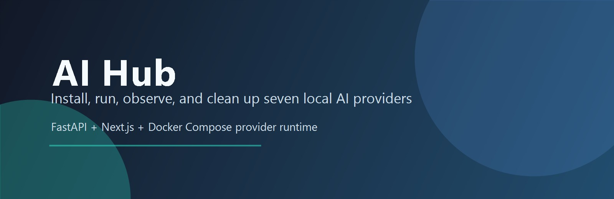
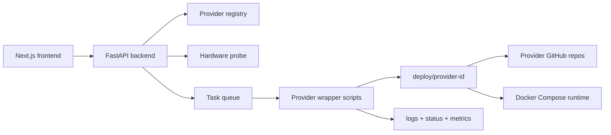

<div align="center">



# AI Hub

**A local command center for installing, running, observing, and cleaning up AI provider projects from GitHub.**

[](https://github.com/ambrouse/frontend-test/actions/workflows/ci.yml)
[](https://github.com/ambrouse/frontend-test/actions/workflows/frontend-release.yml)
[](https://github.com/ambrouse/frontend-test/actions/workflows/backend-release.yml)


[Quick Start](#quick-start) · [Providers](#active-provider-catalog) · [Architecture](#architecture) · [Verification](#verification) · [Release](#release-and-packaging)

</div>

---

## Why AI Hub?

AI Hub is built for local AI workflows where the UI must stay responsive while provider installs, Docker Compose stacks, logs, hardware probes, and long-running lifecycle tasks happen in the background.

It focuses on three things:

- **Real provider execution**: provider source is cloned from GitHub into `deploy/` only when Install is clicked.
- **Low-latency UX**: backend endpoints are cached and measured, lifecycle actions are queued, and the frontend renders real provider data without blocking.
- **Cross-platform operations**: Windows and Linux wrapper scripts share one provider contract for setup, run, stop, delete, logs, status, and metrics.

## Active Provider Catalog

AI Hub currently ships exactly seven active provider wrappers:

| Provider ID | Display name | Default port | Runtime mode | Lifecycle |
| --- | --- | ---: | --- | --- |
| `agentic-commerce-blueprint` | Agentic Commerce Blueprint | `8088` | Docker Compose + NVIDIA API | Install, run, logs, metrics, stop, delete |
| `ai-virtual-assistant-provider` | AI Virtual Assistant Provider | `13301` UI / `13300` API | Docker Compose + NVIDIA API | Install, run, logs, metrics, stop, delete |
| `aiq` | NVIDIA AI-Q Blueprint | `13080` | Docker Compose + NVIDIA AI-Q | Install, run, logs, metrics, stop, delete |
| `nemotron-voice-agent-provider` | Nemotron Voice Agent Provider | `13100` | Docker Compose + NVIDIA API | Install, run, logs, metrics, stop, delete |
| `shop-retail-provider` | Shop Retail Provider | provider manifest port | Docker Compose + retail agents | Install, run, logs, metrics, stop, delete |
| `multi-agent-intelligent-warehouse` | Multi-Agent Intelligent Warehouse | `3001` UI / `8091` API | Docker Compose + NVIDIA API | Install, run, logs, metrics, stop, delete |
| `pdf-to-podcast` | PDF to Podcast | `7860` frontend / dynamic API | Git Bash + Docker Compose + Python/Gradio + NVIDIA/ElevenLabs API | Install, run, logs, metrics, stop, delete |

Removed or archived providers must not appear in the backend registry, frontend fallback data, or provider dispatch scripts.

## Quick Start

### Fresh clone on Windows PowerShell

```powershell
git clone https://github.com/ambrouse/frontend-test.git
cd frontend-test
.\setup.ps1
.\.venv\Scripts\python.exe -m uvicorn app.main:app --reload --app-dir backend
cd frontend
npm run dev
```

### Fresh clone on Linux or macOS

```bash
git clone https://github.com/ambrouse/frontend-test.git
cd frontend-test
./setup.sh
./.venv/bin/python -m uvicorn app.main:app --reload --app-dir backend
cd frontend
npm run dev
```

### Windows Git Bash

```bash
./setup.sh
WATCHFILES_FORCE_POLLING=true ./.venv/Scripts/python.exe -m uvicorn app.main:app --reload --reload-dir backend --app-dir backend
cd frontend
npm run dev
```

If reload is unstable in Git Bash, run without reload:

```bash
./.venv/Scripts/python.exe -m uvicorn app.main:app --app-dir backend
```

Open the app at:

```text
http://localhost:3000
```

The setup scripts check Git, Node/npm, Python 3.11+, Docker, and Docker Compose. Docker is optional for viewing the Hub but required for real provider install/run.

## Provider Install Flow

Provider folders under `providers/` contain the Hub manifest, config defaults, media, and lifecycle wrapper scripts. Install does not use local provider source checked into this repo; it clones the provider source from the provider's GitHub repository into `deploy/{installDirectory}`.

That means provider-source fixes must be committed and pushed to the provider's own repository before fresh install validation. Local-only edits inside `deploy/` are not durable.

## Architecture



### Repository Layout

| Path | Purpose |
| --- | --- |
| `frontend/` | Next.js UI, provider cards, detail pages, real API client, tests, and production build. |
| `backend/` | FastAPI API, hardware snapshot, provider registry, task queue, runtime lifecycle, latency tools. |
| `providers/` | Seven active provider manifests plus Windows/Linux lifecycle wrappers. |
| `deploy/` | Ignored runtime clone target for provider source repos. |
| `docs/` | Provider contract, backend/API notes, and task documentation. |
| `plans/` | Implementation plans and execution phases. |
| `logs/` | Work logs and task summaries. |

## Provider Lifecycle

The frontend only talks to the backend. The backend runs provider wrapper scripts and streams progress through task state and JSON logs.

| Action | API | What happens |
| --- | --- | --- |
| Install | `POST /api/providers/{id}/install` | Clones the provider repo from GitHub into `deploy/{id}` and writes local env/config files. |
| Run | `POST /api/providers/{id}/run` | Starts the provider runtime, usually Docker Compose, and updates `runtime/status.json`. |
| Stop | `POST /api/providers/{id}/stop` | Stops provider services and writes stopped state. |
| Delete | `DELETE /api/providers/{id}` | Stops and removes deployed source files safely from `deploy/`. |
| Observe | `GET /api/providers/{id}/logs`, `/status`, `/metrics`, `/config` | Feeds the detail page with real runtime data. |

Each provider manifest can expose supported operating systems, architectures, required tools, runtime modes, setup notes, and minimum/recommended hardware requirements.

## Provider Images

Provider-specific images live in the Hub provider folder, not in `deploy/`. Put image files in:

```text
providers/{provider_id}/media/
```

The backend also accepts `providers/{provider_id}/images/` and `providers/{provider_id}/assets/` as fallback folders. If images exist, the first sorted image becomes the card/banner image and the whole set becomes the detail-page slideshow. If no provider image exists, the manifest `visual.imageUrl` fallback is used.

## Verification

### Backend

```powershell
.\.venv\Scripts\python -m ruff check backend
.\.venv\Scripts\python -m ruff format --check backend
.\.venv\Scripts\python -m mypy backend\app
.\.venv\Scripts\python -m pytest backend
.\.venv\Scripts\python backend\scripts\validate_providers.py
.\.venv\Scripts\python backend\scripts\provider_dry_run_lifecycle.py
.\.venv\Scripts\python backend\scripts\benchmark_latency.py --threshold-ms 100
.\.venv\Scripts\python backend\scripts\check_no_secrets.py
```

### Frontend

```powershell
npm.cmd run typecheck --prefix frontend
npm.cmd run test --prefix frontend
npm.cmd run build --prefix frontend
```

### Script Syntax

```powershell
Get-ChildItem providers -Recurse -Filter *.ps1 | ForEach-Object {
  $tokens = $null
  $errors = $null
  [void][System.Management.Automation.Language.Parser]::ParseFile($_.FullName, [ref]$tokens, [ref]$errors)
  if ($errors) { throw $errors }
}
```

```bash
bash -lc "bash -n setup.sh && find providers -path '*/scripts/linux/*.sh' -print0 | xargs -0 -n1 bash -n"
```

## CI/CD

GitHub Actions checks:

- workflow linting with `actionlint`;
- frontend typecheck, unit tests, production build, and dependency audit;
- backend lint, format check, mypy, pytest with coverage gate, provider manifest validation, secret scan, dry-run lifecycle, package build, dependency audit, and latency benchmark;
- provider wrapper syntax for Bash and PowerShell;
- frontend and backend production artifact generation after successful CI.

## Release and Packaging

Version metadata is kept in:

- `backend/pyproject.toml`
- `frontend/package.json`

Release tags are split by artifact type:

```text
backend-vX.Y.Z
frontend-vX.Y.Z
```

Backend release workflow builds wheel and source distribution from `backend/dist/*`. Frontend release workflow builds a standalone Next.js artifact from `frontend/artifact`.

Before creating a release, run the verification commands above and confirm CI passes on the pushed branch or tag.

## Operational Notes

- Never commit `.env`, `.env.local`, provider logs, runtime files, `deploy/` contents, API keys, tokens, or local config secrets.
- NVIDIA and third-party API keys are accepted through setup or lifecycle requests and written only to ignored local files.
- Hardware shortages are shown as warnings. Missing required tools are shown clearly and provider scripts fail with actionable messages.
- Provider source fixes should be made upstream first, pushed to the provider repo, then retested through Hub install from GitHub.

## License

AI Hub is licensed under the [Apache License 2.0](LICENSE).
