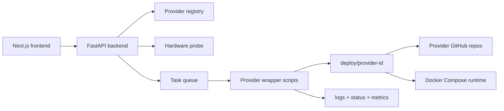

<div align="center">

# AI Hub

**A low-latency local command center for installing, running, observing, and cleaning up AI provider projects from GitHub.**

[](https://github.com/ambrouse/frontend-test/actions/workflows/ci.yml)
[](https://github.com/ambrouse/frontend-test/actions/workflows/frontend-release.yml)


[Quick Start](#quick-start) · [Architecture](#architecture) · [Provider Lifecycle](#provider-lifecycle) · [Verification](#verification) · [License](#license)

</div>

---

## Why AI Hub?

AI Hub is built for local AI workflows where the UI must stay responsive while provider installs, Docker Compose stacks, logs, hardware probes, and long-running lifecycle tasks happen in the background.

It focuses on three things:

- **Real provider execution**: provider source is cloned from GitHub into `deploy/` only when Install is clicked.
- **Low-latency UX**: backend endpoints are cached and measured, lifecycle actions are queued, and the frontend renders real data without blocking.
- **Cross-platform operations**: Windows and Linux wrapper scripts share one provider contract for setup, run, stop, delete, logs, status, and metrics.

## Current Provider Integrations

| Provider | GitHub source | Port | Mode | Lifecycle |
| --- | --- | ---: | --- | --- |
| Agentic Commerce Blueprint | `baolnq-ai/Agentic-Commerce-blueprint-provider-` | `8088` | Docker Compose + NVIDIA API | Install, run, logs, metrics, stop, delete |
| Multi-Agent Intelligent Warehouse | `baolnq-ai/Multi-Agent-Intelligent-WarehousePublic-nvidia` | `8091` | Docker Compose + NVIDIA API | Install, run, logs, metrics, stop, delete |

Both providers are tested through the Hub backend by cloning from GitHub into `deploy/{provider_id}` and then running the full lifecycle.

## Quick Start

### Windows PowerShell

```powershell
.\setup.ps1
.\.venv\Scripts\python -m uvicorn app.main:app --reload --app-dir backend
cd frontend
npm run dev
```

### Linux or Git Bash

```bash
./setup.sh
./.venv/bin/python -m uvicorn app.main:app --reload --app-dir backend
cd frontend
npm run dev
```

Open the app at:

```text
http://localhost:3000
```

The setup scripts check Git, Node/npm, Python 3.11+, Docker, and Docker Compose. When a dependency is missing, they ask before installing with the available package manager (`winget`, `apt`, `dnf`, `pacman`, or `brew`). Docker is optional for viewing the Hub but required for real provider install/run.

## Architecture



### Repository Layout

| Path | Purpose |
| --- | --- |
| `frontend/` | Next.js UI, provider cards, detail pages, real API client, tests and production build. |
| `backend/` | FastAPI API, hardware snapshot, provider registry, task queue, runtime lifecycle, latency tools. |
| `providers/` | Provider manifests and Windows/Linux lifecycle wrappers. |
| `deploy/` | Ignored runtime clone target for provider source repos. |
| `docs/` | Provider contract and backend/API notes. |
| `plans/` | Implementation plans and execution phases. |
| `logs/` | Work logs and task summaries. |

## Provider Lifecycle

The frontend only talks to the backend. The backend runs provider wrapper scripts and streams progress through task state and JSON logs.

| Action | API | What happens |
| --- | --- | --- |
| Install | `POST /api/providers/{id}/install` | Clones the provider repo from GitHub into `deploy/{id}` and writes local env/config files. |
| Run | `POST /api/providers/{id}/run` | Starts the provider runtime, usually Docker Compose, and updates `runtime/status.json`. |
| Stop | `POST /api/providers/{id}/stop` | Stops provider services and writes stopped state. |
| Delete | `DELETE /api/providers/{id}` | Stops and removes deployed source files safely from `deploy/`. |
| Observe | `GET /api/providers/{id}/logs`, `/status`, `/metrics`, `/config` | Feeds the detail page with real runtime data. |

Each provider manifest can expose:

- supported operating systems and architectures;
- required tools such as Git, Docker, and Docker Compose;
- framework/runtime notes;
- API mode or GPU/NIM mode;
- minimum and recommended hardware requirements.

The frontend renders this readiness data so users can see what the current machine has before installing.

## Performance Targets

The project is tuned for a small local app that should feel immediate:

- provider listing and detail endpoints are warmed and cached;
- slow provider work happens in background tasks;
- hardware GPU probes are refreshed asynchronously;
- latency benchmark gate targets p95 below `100ms`.

Recent local benchmark p95 values were in the low single-digit milliseconds for health, hardware, provider list/detail, logs, and metrics.

## Verification

### Backend

```powershell
.\.venv\Scripts\python -m ruff check backend
.\.venv\Scripts\python -m ruff format --check backend
.\.venv\Scripts\python -m mypy backend\app
.\.venv\Scripts\python -m pytest backend
.\.venv\Scripts\python backend\scripts\validate_providers.py
.\.venv\Scripts\python backend\scripts\provider_dry_run_lifecycle.py
.\.venv\Scripts\python backend\scripts\benchmark_latency.py --threshold-ms 100
.\.venv\Scripts\python backend\scripts\check_no_secrets.py
```

### Frontend

```powershell
npm.cmd run typecheck --prefix frontend
npm.cmd run test --prefix frontend
npm.cmd run build --prefix frontend
```

### Script Syntax

```powershell
Get-ChildItem providers -Recurse -Filter *.ps1 | ForEach-Object {
  $errors = $null
  [void][System.Management.Automation.Language.Parser]::ParseFile($_.FullName, [ref]$null, [ref]$errors)
  if ($errors) { throw $errors }
}
```

```bash
bash -lc "bash -n setup.sh && find providers -path '*/scripts/linux/*.sh' -print0 | xargs -0 -n1 bash -n"
```

## CI/CD

GitHub Actions currently checks:

- frontend typecheck, unit tests, and production build on Linux/Windows targets;
- backend lint, format, mypy, pytest, coverage, provider manifest validation, secret scan, dry-run lifecycle, and latency benchmark;
- provider wrapper syntax for Bash and PowerShell;
- frontend production artifact generation.

## Operational Notes

- Never commit `.env`, `.env.local`, provider logs, runtime files, or `deploy/` contents.
- NVIDIA API keys are accepted through setup or lifecycle requests and written only to ignored local files.
- Hardware shortages are shown as warnings. Missing required tools are shown clearly and provider scripts fail with actionable messages.
- Provider source fixes should be made upstream first, then retested through Hub install from GitHub.

## License

AI Hub is licensed under the [Apache License 2.0](LICENSE).
