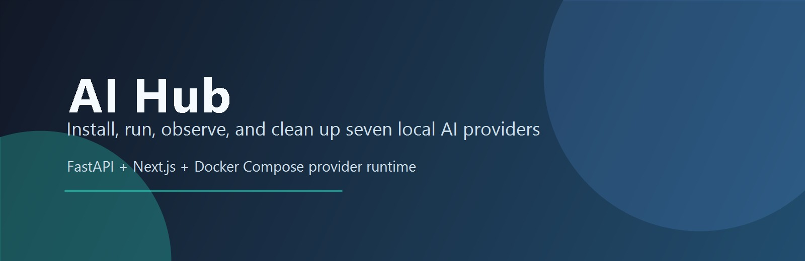
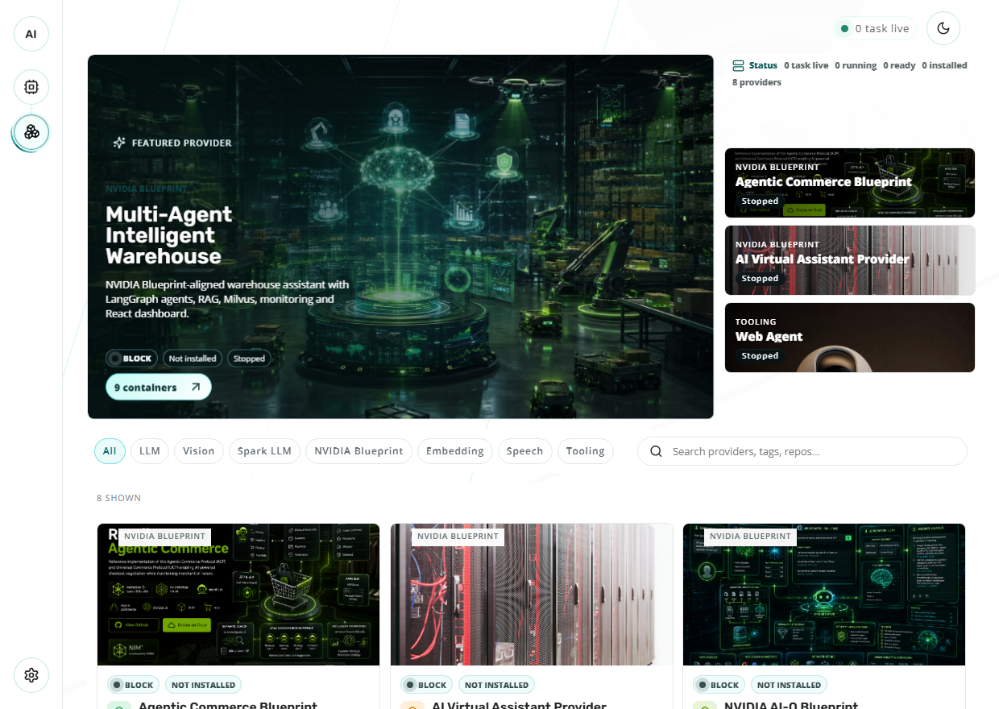
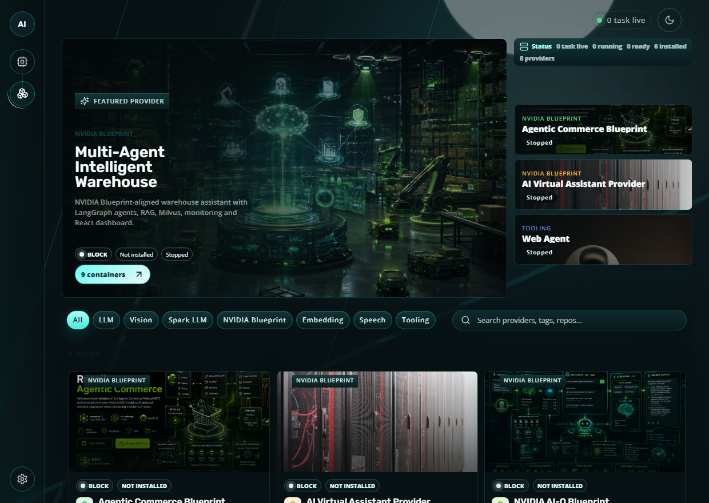
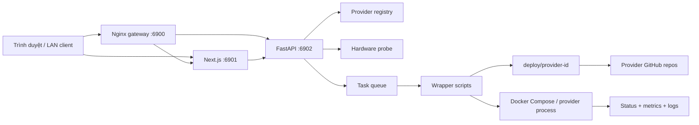

<div align="center">

<picture>
  
</picture>

# AI Hub

**Bảng điều khiển cục bộ để cài đặt, chạy, theo dõi và dọn dẹp các provider AI.**

<a href="https://github.com/ambrouse/frontend-test/actions/workflows/ci.yml"></a>
<a href="https://github.com/ambrouse/frontend-test/actions/workflows/security.yml"></a>


[Bắt đầu nhanh](#bắt-đầu-nhanh) ·
[Danh mục provider](#danh-mục-provider) ·
[Kiến trúc](#kiến-trúc) ·
[Kiểm chứng](#kiểm-chứng) ·
[Tài liệu](#tài-liệu)

</div>

---

## Cập Nhật

- Cập nhật gần nhất: **2026-06-04**.
- README dùng tiếng Việt có dấu theo quy định trong `.codex/skills/readme-style/SKILL.md`.
- Banner chính dùng ảnh tĩnh local `banner.jpg`; không còn dùng banner động cũ.
- Các ảnh minh họa trong README dùng file local đã có trong repo, không phụ thuộc dashboard ảnh ngoài dễ vỡ.

## Tổng Quan

AI Hub phục vụ luồng vận hành AI cục bộ: xem provider, kiểm tra tài nguyên máy, cài đặt source provider khi cần, chạy vòng đời provider và đọc trạng thái/log/metric qua một giao diện thống nhất.

Trọng tâm kỹ thuật:

- **Frontend**: Next.js chạy mặc định ở `6901`.
- **Backend**: FastAPI chạy mặc định ở `6902`.
- **Gateway**: Nginx qua Docker Compose chạy mặc định ở `6900`.
- **Provider runtime**: wrapper script trong `providers/` điều phối install, run, stop, delete, health, log và metric.

## Bảng Tín Hiệu

| Hạng mục | Trạng thái hiện tại |
| --- | --- |
| Provider đang khai báo | 8 provider active |
| Backend test | `pytest` với coverage gate trong CI |
| Frontend test | `vitest`, typecheck và production build |
| Gateway | `docker compose -f docker-compose.nginx.yml config -q` và `nginx -t` |
| Bảo mật | npm audit production, pip audit, secret scan backend |
| Evidence | Ảnh trong `tests/`, không giữ JSON/log tạm trong CI |

## Bằng Chứng Giao Diện

| Light mode | Dark mode |
| --- | --- |
| [](tests/hub-control-palette-2026-06-04/app/01-light-hub-controls.png) | [](tests/hub-control-palette-2026-06-04/app/03-dark-hub-controls.png) |

| Navbar light mode | Banner provider |
| --- | --- |
| [](tests/navbar-light-ring-2026-06-04/app/03-light-mobile-navbar-hub-hover.png) | [](tests/hub-control-palette-2026-06-04/app/02-light-feature-card-controls.png) |

## Danh Mục Provider

| Provider | Nhóm | Cổng mặc định | Ghi chú |
| --- | --- | ---: | --- |
| `agentic-commerce-blueprint` | NVIDIA Blueprint commerce | `6903` | Cài từ source provider khi bấm Install. |
| `ai-virtual-assistant-provider` | NVIDIA Blueprint assistant | `13301` UI / `13300` API | Provider trợ lý ảo. |
| `aiq` | RAG / knowledge | `6917` | Provider AI-Q. |
| `nemotron-voice-agent-provider` | Speech / WebRTC | `13100` | Provider voice agent. |
| `shop-retail-provider` | Retail search | Theo manifest | Provider bán lẻ. |
| `multi-agent-intelligent-warehouse` | Warehouse agents | `3001` UI / `8091` API | Provider kho vận. |
| `pdf-to-podcast` | Gradio audio | `6923` frontend / API động | Provider chuyển PDF sang audio. |
| `web-agent` | Web search tooling | Theo manifest | Provider tìm kiếm web. |

Provider đã gỡ hoặc lưu trữ không được xuất hiện trong backend registry, fallback data của frontend hoặc script dispatch provider.

## Bắt Đầu Nhanh

Yêu cầu chính:

- Git.
- Node.js 22.
- Python 3.11.
- Docker nếu muốn chạy Nginx gateway hoặc provider thật.
- Bash/Git Bash cho `setup.sh`.

Chạy từ thư mục gốc:

```bash
git clone https://github.com/ambrouse/frontend-test.git
cd frontend-test
./setup.sh
```

Mở ứng dụng:

```text
http://localhost:6901
```

Khi Docker sẵn sàng, gateway Nginx chạy ở:

```text
http://localhost:6900
```

Dừng sạch:

```bash
./stop.sh
```

`setup.sh` kiểm tra Git, Node/npm, Python, curl, port, Docker và image Nginx trước khi khởi động. Nếu port đang bận, script hỏi cách xử lý thay vì tự ý giết process.

## Cài Bằng Docker Hub

Image all-in-one chạy cả frontend và backend, không cần cài Node.js hoặc Python trên máy host.

```bash
docker run --rm --name ai-hub -p 6901:6901 -p 6902:6902 baonguyen3568/ai-hub:0.1.1
```

Mở ứng dụng:

```text
http://localhost:6901
```

Kiểm tra backend:

```bash
curl http://localhost:6902/api/health
```

Nếu muốn chạy bằng Compose:

```bash
docker compose -f docker-compose.hub.yml up -d
```

Image Docker Hub: `baonguyen3568/ai-hub:0.1.1`.

## Lệnh Kiểm Chứng

Frontend:

```bash
cd frontend
npm ci
npm run typecheck
npm run test
npm run build
npm audit --omit=dev --audit-level=moderate
```

Backend:

```bash
cd backend
python -m pip install -e ".[dev]"
ruff check .
ruff format --check .
mypy app
pytest --cov=app --cov-report=term-missing --cov-fail-under=75
python scripts/validate_providers.py
python scripts/check_no_secrets.py
```

Repository hygiene:

```bash
docker compose -f docker-compose.nginx.yml config -q
```

CI còn kiểm tra link README/docs, evidence trong `tests/`, script provider và Nginx config.

## Kiến Trúc


```mermaid
flowchart LR
  Browser[Trình duyệt / LAN client] --> Gateway[Nginx gateway :6900]
  Browser --> UI[Next.js :6901]
  Gateway --> UI
  Gateway --> API[FastAPI :6902]
  UI --> API
  API --> Registry[Provider registry]
  API --> Hardware[Hardware probe]
  API --> Tasks[Task queue]
  Tasks --> Scripts[Wrapper scripts]
  Scripts --> Deploy[deploy/provider-id]
  Scripts --> Runtime[Docker Compose / provider process]
  Runtime --> Logs[Status + metrics + logs]
  Deploy --> GitHub[Provider GitHub repos]
```

## Cấu Trúc Repo

| Đường dẫn | Vai trò |
| --- | --- |
| `frontend/` | Ứng dụng Next.js, UI Hub và test Vitest. |
| `backend/` | FastAPI, provider registry, task queue, hardware probe và API. |
| `providers/` | Manifest, config, media và wrapper script của provider. |
| `infra/nginx/` | Template và ghi chú cho gateway Nginx. |
| `docs/` | Tài liệu kỹ thuật và ghi chú vận hành. |
| `logs/` | Nhật ký công việc, không dùng để lưu secret hay log runtime nhạy cảm. |
| `plans/` | Kế hoạch task theo từng đợt. |
| `tests/` | Bằng chứng kiểm thử đã chọn lọc, chủ yếu là ảnh và README. |

## Tài Liệu

| Chủ đề | Link |
| --- | --- |
| Setup và gateway Nginx | [`docs/setup-and-nginx-gateway-2026-05-28.md`](docs/setup-and-nginx-gateway-2026-05-28.md) |
| Backend API | [`docs/backend-api.md`](docs/backend-api.md) |
| Checklist provider source | [`docs/provider-source-hub-readiness-checklist.md`](docs/provider-source-hub-readiness-checklist.md) |
| Design system | [`docs/design-system.md`](docs/design-system.md) |
| CI và README | [`docs/ci-and-readme-polish-2026-05-28.md`](docs/ci-and-readme-polish-2026-05-28.md) |
| README visual dashboard | [`docs/readme-visual-dashboard-2026-05-28.md`](docs/readme-visual-dashboard-2026-05-28.md) |

## Quy Tắc Vận Hành

- Không commit `.env`, `.env.local`, key, token, private key, log runtime nhạy cảm hoặc dữ liệu trong `deploy/`.
- Provider source thật được clone vào `deploy/` khi cài đặt; sửa provider source phải commit ở repo provider tương ứng.
- Evidence trong `tests/` phải có README, ảnh rõ kết quả, không giữ `.json`, `.log`, `.har`, `.tmp` hoặc `trace.zip`.
- README, docs mới và logs công việc mới viết bằng tiếng Việt có dấu.

## Kiểm Chứng Gần Nhất

- `npm run typecheck`: đạt.
- `npm run build`: đạt.
- `npm audit --omit=dev --audit-level=moderate`: đạt.
- Repository link check: đạt với 153 file markdown.
- Evidence hygiene: cần sạch hoàn toàn trước khi push, đặc biệt không để JSON/log tạm trong `tests/`.

---

dev by ambrouse
