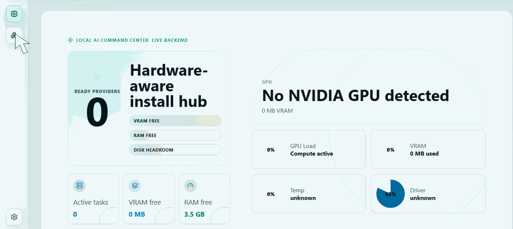
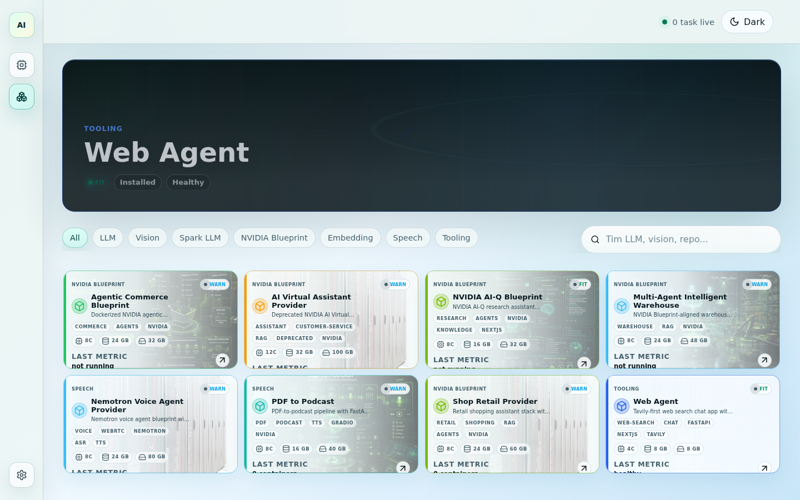
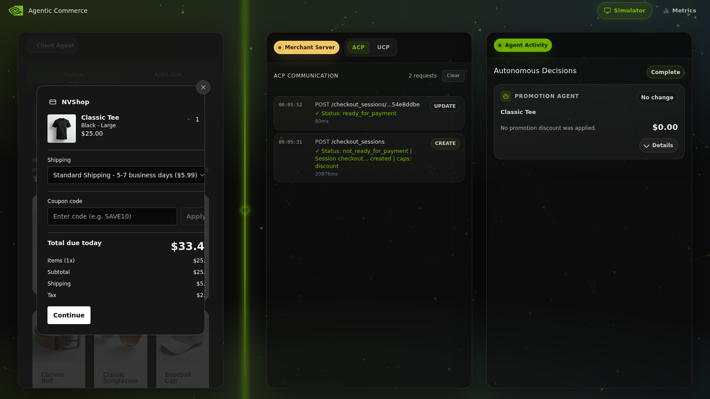
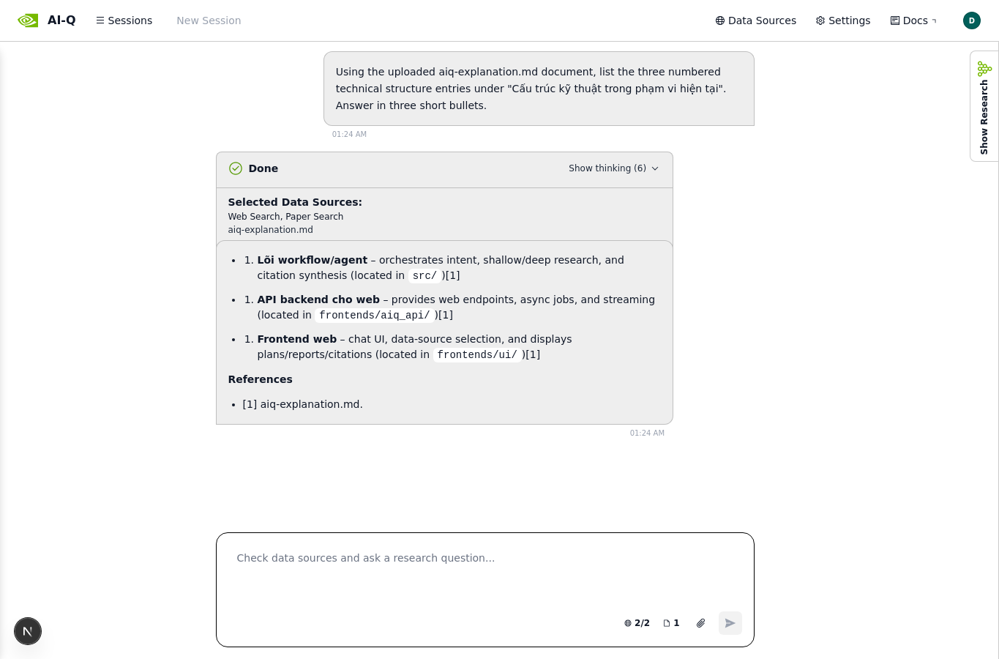
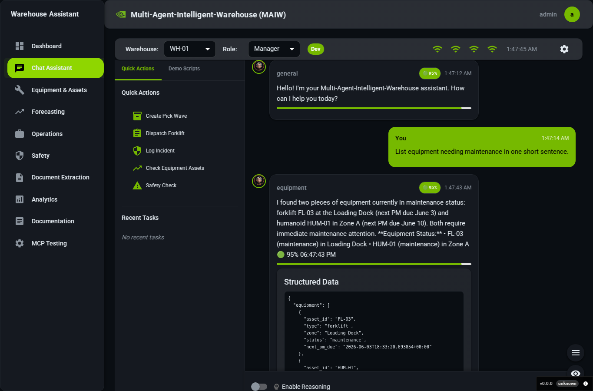
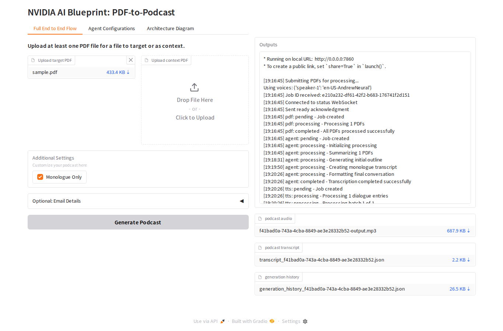
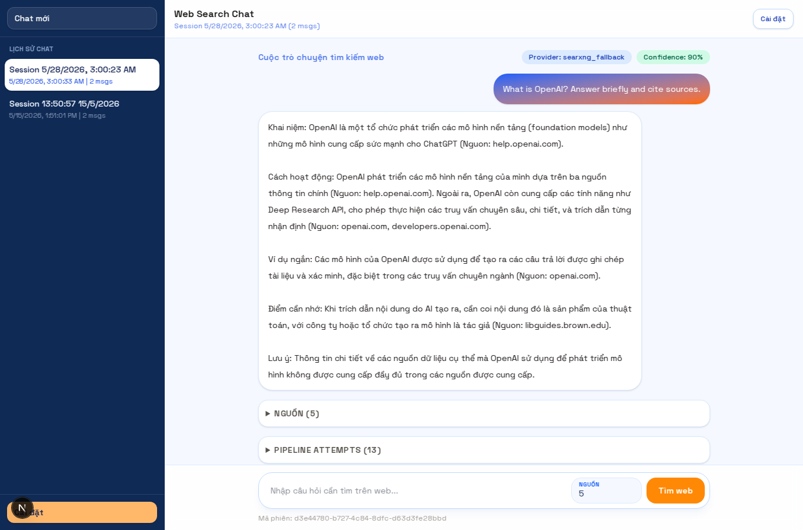
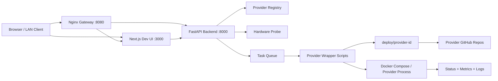

<div align="center">

<picture>
  
</picture>

# AI Hub

**A local command center for installing, running, observing, and cleaning up AI provider projects from GitHub.**

<a href="https://github.com/ambrouse/frontend-test/actions/workflows/ci.yml"></a>
<a href="https://github.com/ambrouse/frontend-test/actions/workflows/security.yml"></a>
<a href="https://github.com/ambrouse/frontend-test/actions/workflows/frontend-release.yml"></a>
<a href="https://github.com/ambrouse/frontend-test/actions/workflows/backend-release.yml"></a>


<a href="#quick-start">Quick Start</a> ·
<a href="#active-provider-catalog">Providers</a> ·
<a href="#architecture">Architecture</a> ·
<a href="#verification">Verification</a> ·
<a href="#docs-index">Docs</a> ·
<a href="#release-and-packaging">Release</a>

</div>

---

## Why AI Hub?

AI Hub is built for local AI workflows where the UI must stay responsive while provider installs, Docker Compose stacks, logs, hardware probes, and long-running lifecycle tasks happen in the background.

It focuses on three things:

- **Real provider execution**: provider source is cloned from GitHub into `deploy/` only when Install is clicked.
- **Low-latency UX**: backend endpoints are cached and measured, lifecycle actions are queued, and the frontend renders real provider data without blocking.
- **Cross-platform operations**: Windows and Linux wrapper scripts share one provider contract for setup, run, stop, delete, logs, status, and metrics.

<table>
  <tr>
    <td width="33%">
      <br>
      <strong>Provider lifecycle</strong><br>
      Install, run, observe, stop, and delete provider stacks through one backend contract.
    </td>
    <td width="33%">
      <br>
      <strong>Runtime visibility</strong><br>
      Hub detail pages stream task progress, service logs, status, metrics, and config.
    </td>
    <td width="33%">
      <br>
      <strong>LAN-ready dev</strong><br>
      Docker-managed Nginx serves frontend and backend through one stable local entrypoint.
    </td>
  </tr>
</table>

## AI Ops Cockpit

<table>
  <tr>
    <td width="50%">
      
    </td>
    <td width="50%">
      
    </td>
  </tr>
  <tr>
    <td width="50%">
      
    </td>
    <td width="50%">
      <table>
        <tr>
          <td></td>
          <td></td>
        </tr>
        <tr>
          <td></td>
          <td></td>
        </tr>
        <tr>
          <td></td>
          <td></td>
        </tr>
      </table>
    </td>
  </tr>
</table>

## Visual Proof Board

<table>
  <tr>
    <td width="33%">
      <a href="tests/ip-access-evidence-2026-05-28/hub-ip-providers.png">
        
      </a>
      <br><strong>LAN Hub</strong><br>
      Nginx gateway loads real provider cards through <code>192.168.x.x:8080</code>.
    </td>
    <td width="33%">
      <a href="tests/provider-nvidia-full-stability-evidence-2026-05-27/agentic-commerce-blueprint/function/01-native-checkout-session-output.png">
        
      </a>
      <br><strong>Commerce Agent</strong><br>
      Product selection and checkout session proof from the provider UI.
    </td>
    <td width="33%">
      <a href="tests/provider-nvidia-full-stability-evidence-2026-05-27/aiq/function/02-file-grounded-chat-answer.png">
        
      </a>
      <br><strong>AI-Q RAG</strong><br>
      File-grounded chat answer captured after upload.
    </td>
  </tr>
  <tr>
    <td width="33%">
      <a href="tests/provider-nvidia-full-stability-evidence-2026-05-27/multi-agent-intelligent-warehouse/function/02-chat-maintenance-output.png">
        
      </a>
      <br><strong>Warehouse Agents</strong><br>
      Maintenance assistant output from seeded warehouse data.
    </td>
    <td width="33%">
      <a href="tests/provider-nvidia-full-stability-evidence-2026-05-27/pdf-to-podcast/function/02-generation-completed-from-frontend.png">
        
      </a>
      <br><strong>PDF to Podcast</strong><br>
      Frontend generation flow completed with visible output.
    </td>
    <td width="33%">
      <a href="tests/provider-nvidia-full-stability-evidence-2026-05-27/web-agent/function/01-web-search-openai-output-with-sources.png">
        
      </a>
      <br><strong>Web Agent</strong><br>
      Search-backed answer with visible source links.
    </td>
  </tr>
</table>

## Active Provider Catalog

AI Hub currently ships exactly eight active provider wrappers:

| Provider | Runtime | Default entry | Evidence posture | Lifecycle |
| --- | --- | ---: | --- | --- |
| `agentic-commerce-blueprint`<br>Agentic Commerce Blueprint |  | `8088` |  | Install · Run · Logs · Metrics · Stop · Delete |
| `ai-virtual-assistant-provider`<br>AI Virtual Assistant Provider |  | `13301` UI / `13300` API |  | Install · Run · Logs · Metrics · Stop · Delete |
| `aiq`<br>NVIDIA AI-Q Blueprint |  | `13080` |  | Install · Run · Logs · Metrics · Stop · Delete |
| `nemotron-voice-agent-provider`<br>Nemotron Voice Agent Provider |  | `13100` |  | Install · Run · Logs · Metrics · Stop · Delete |
| `shop-retail-provider`<br>Shop Retail Provider |  | manifest port |  | Install · Run · Logs · Metrics · Stop · Delete |
| `multi-agent-intelligent-warehouse`<br>Multi-Agent Intelligent Warehouse |  | `3001` UI / `8091` API |  | Install · Run · Logs · Metrics · Stop · Delete |
| `pdf-to-podcast`<br>PDF to Podcast |  | `7860` frontend / dynamic API |  | Install · Run · Logs · Metrics · Stop · Delete |
| `web-agent`<br>Web Agent |  | manifest port |  | Install · Run · Logs · Metrics · Stop · Delete |

Removed or archived providers must not appear in the backend registry, frontend fallback data, or provider dispatch scripts.

## Quick Start

<table>
  <tr>
    <td width="50%">
      <strong>Local dev</strong><br>
      <code>frontend:3000</code> talks to <code>backend:8000</code> with same-origin API rewrites.
    </td>
    <td width="50%">
      <strong>Nginx gateway</strong><br>
      <code>localhost:8080</code> or <code>&lt;LAN-IP&gt;:8080</code> serves frontend and API from one origin.
    </td>
  </tr>
</table>

<details open>
<summary><strong>Fresh clone on Linux or macOS</strong></summary>

```bash
git clone https://github.com/ambrouse/frontend-test.git
cd frontend-test
./setup.sh
./.venv/bin/python -m uvicorn app.main:app --reload --app-dir backend
cd frontend
npm run dev
```

</details>

<details>
<summary><strong>Fresh clone on Windows PowerShell</strong></summary>

```powershell
git clone https://github.com/ambrouse/frontend-test.git
cd frontend-test
.\setup.ps1
.\.venv\Scripts\python.exe -m uvicorn app.main:app --reload --app-dir backend
cd frontend
npm run dev
```

</details>

<details>
<summary><strong>Windows Git Bash</strong></summary>

```bash
./setup.sh
WATCHFILES_FORCE_POLLING=true ./.venv/Scripts/python.exe -m uvicorn app.main:app --reload --reload-dir backend --app-dir backend
cd frontend
npm run dev
```

If reload is unstable in Git Bash, run without reload:

```bash
./.venv/Scripts/python.exe -m uvicorn app.main:app --app-dir backend
```

</details>

Open the app at:

```text
http://localhost:3000
```

Or start the Docker-managed Nginx gateway after the backend and frontend are running:

```bash
docker compose -f docker-compose.nginx.yml up -d
```

Then open `http://localhost:8080` or the LAN URL printed by `setup.sh` / `setup.ps1`.

The setup scripts check Git, Node/npm, Python 3.11+, Docker, and Docker Compose. Docker is optional for viewing the Hub but required for real provider install/run. If you enter an NVIDIA key, setup updates only `NVIDIA_API_KEY` in `.env.local` and preserves other local variables.

## Provider Install Flow

Provider folders under `providers/` contain the Hub manifest, config defaults, media, and lifecycle wrapper scripts. Install does not use local provider source checked into this repo; it clones the provider source from the provider's GitHub repository into `deploy/{installDirectory}`.

That means provider-source fixes must be committed and pushed to the provider's own repository before fresh install validation. Local-only edits inside `deploy/` are not durable.

## Architecture


```mermaid
flowchart LR
  Browser[Browser / LAN Client] --> Gateway[Nginx Gateway :8080]
  Browser --> UI[Next.js Dev UI :3000]
  Gateway --> UI
  Gateway --> API[FastAPI Backend :8000]
  UI --> API
  API --> Registry[Provider Registry]
  API --> Hardware[Hardware Probe]
  API --> Tasks[Task Queue]
  Tasks --> Scripts[Provider Wrapper Scripts]
  Scripts --> Deploy[deploy/provider-id]
  Scripts --> Runtime[Docker Compose / Provider Process]
  Runtime --> Logs[Status + Metrics + Logs]
  Deploy --> GitHub[Provider GitHub Repos]
```

### Repository Layout

| Path | Purpose |
| --- | --- |
| `frontend/` | Next.js UI, provider cards, detail pages, real API client, tests, and production build. |
| `backend/` | FastAPI API, hardware snapshot, provider registry, task queue, runtime lifecycle, latency tools. |
| `providers/` | Eight active provider manifests plus Windows/Linux lifecycle wrappers. |
| `deploy/` | Ignored runtime clone target for provider source repos. |
| `docs/` | Provider contract, backend/API notes, and task documentation. |
| `plans/` | Implementation plans and execution phases. |
| `logs/` | Work logs and task summaries. |
| `tests/` | Curated test evidence, screenshots, and helper test artifacts. |

## Provider Lifecycle

The frontend only talks to the backend. The backend runs provider wrapper scripts and streams progress through task state and JSON logs.

| Action | API | What happens |
| --- | --- | --- |
| Install | `POST /api/providers/{id}/install` | Clones the provider repo from GitHub into `deploy/{id}` and writes local env/config files. |
| Run | `POST /api/providers/{id}/run` | Starts the provider runtime, usually Docker Compose, and updates `runtime/status.json`. |
| Stop | `POST /api/providers/{id}/stop` | Stops provider services and writes stopped state. |
| Delete | `DELETE /api/providers/{id}` | Stops and removes deployed source files safely from `deploy/`. |
| Observe | `GET /api/providers/{id}/logs`, `/status`, `/metrics`, `/config` | Feeds the detail page with real runtime data. |

Each provider manifest can expose supported operating systems, architectures, required tools, runtime modes, setup notes, and minimum/recommended hardware requirements.

## Provider Images

Provider-specific images live in the Hub provider folder, not in `deploy/`. Put image files in:

```text
providers/{provider_id}/media/
```

The backend also accepts `providers/{provider_id}/images/` and `providers/{provider_id}/assets/` as fallback folders. If images exist, the first sorted image becomes the card/banner image and the whole set becomes the detail-page slideshow. If no provider image exists, the manifest `visual.imageUrl` fallback is used.

## Verification

### Backend

```powershell
.\.venv\Scripts\python -m ruff check backend
.\.venv\Scripts\python -m ruff format --check backend
.\.venv\Scripts\python -m mypy backend\app
.\.venv\Scripts\python -m pytest backend
.\.venv\Scripts\python backend\scripts\validate_providers.py
.\.venv\Scripts\python backend\scripts\provider_dry_run_lifecycle.py
.\.venv\Scripts\python backend\scripts\benchmark_latency.py --threshold-ms 100
.\.venv\Scripts\python backend\scripts\check_no_secrets.py
```

### Frontend

```powershell
npm.cmd run typecheck --prefix frontend
npm.cmd run test --prefix frontend
npm.cmd run build --prefix frontend
```

### Script Syntax

```powershell
Get-ChildItem providers -Recurse -Filter *.ps1 | ForEach-Object {
  $tokens = $null
  $errors = $null
  [void][System.Management.Automation.Language.Parser]::ParseFile($_.FullName, [ref]$tokens, [ref]$errors)
  if ($errors) { throw $errors }
}
```

```bash
bash -lc "bash -n setup.sh && find providers -path '*/scripts/linux/*.sh' -print0 | xargs -0 -n1 bash -n"
```

## Docs Index

| Topic | Document |
| --- | --- |
| Setup and LAN/Nginx gateway | [`docs/setup-and-nginx-gateway-2026-05-28.md`](docs/setup-and-nginx-gateway-2026-05-28.md) |
| CI and README polish | [`docs/ci-and-readme-polish-2026-05-28.md`](docs/ci-and-readme-polish-2026-05-28.md) |
| README visual dashboard | [`docs/readme-visual-dashboard-2026-05-28.md`](docs/readme-visual-dashboard-2026-05-28.md) |
| Backend API contract | [`docs/backend-api.md`](docs/backend-api.md) |
| Provider source readiness | [`docs/provider-source-hub-readiness-checklist.md`](docs/provider-source-hub-readiness-checklist.md) |
| Design system | [`docs/design-system.md`](docs/design-system.md) |

## CI/CD

GitHub Actions checks:

- workflow linting with `actionlint`;
- repository hygiene for README/docs links, evidence artifacts, duplicate screenshots, and Nginx compose/template validation;
- root setup smoke without secrets;
- frontend typecheck, unit tests, production build, and dependency audit;
- backend lint, format check, mypy, pytest with coverage gate, provider manifest validation, secret scan, dry-run lifecycle, package build, dependency audit, and latency benchmark;
- provider wrapper syntax for Bash and PowerShell;
- Dependency Review and CodeQL security analysis;
- frontend and backend production artifact generation after successful CI.

## Release and Packaging

Version metadata is kept in:

- `backend/pyproject.toml`
- `frontend/package.json`

Release tags are split by artifact type:

```text
backend-vX.Y.Z
frontend-vX.Y.Z
```

Backend release workflow builds wheel and source distribution from `backend/dist/*`. Frontend release workflow builds a standalone Next.js artifact from `frontend/artifact`.

Before creating a release, run the verification commands above and confirm CI passes on the pushed branch or tag.

## Operational Notes

- Never commit `.env`, `.env.local`, provider logs, runtime files, `deploy/` contents, API keys, tokens, or local config secrets.
- NVIDIA and third-party API keys are accepted through setup or lifecycle requests and written only to ignored local files.
- Hardware shortages are shown as warnings. Missing required tools are shown clearly and provider scripts fail with actionable messages.
- Provider source fixes should be made upstream first, pushed to the provider repo, then retested through Hub install from GitHub.

## License

AI Hub is licensed under the [Apache License 2.0](LICENSE).
